# 파이프라인 Diagram

> 전체 라벨링 파이프라인의 데이터 흐름을 단계별 IN/OUT 예시와 함께 정리합니다.
> 모든 다이어그램은 Mermaid 문법으로 작성되어 복사·붙여넣기 후 즉시 렌더링됩니다.

---

## 1. 전체 흐름 개요

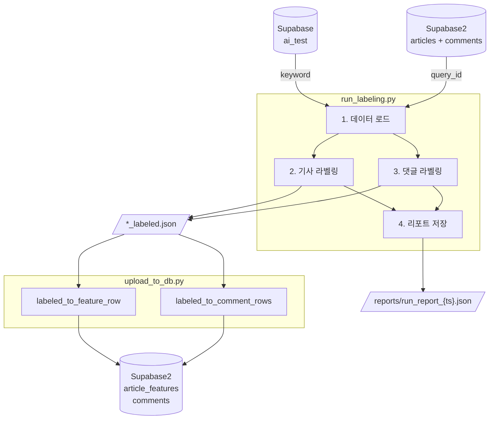

---

## 2. 데이터 로드

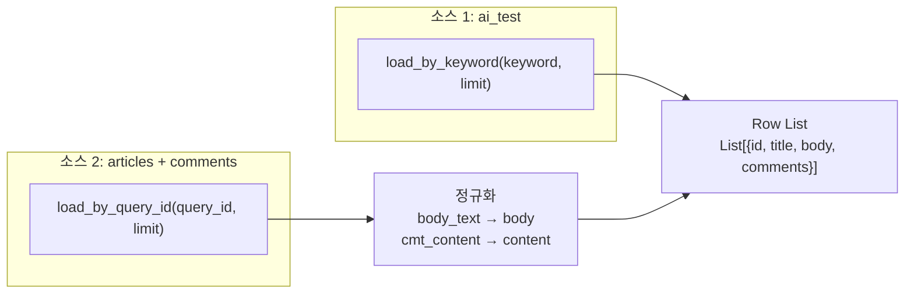

### IN

```
# 소스 1 (ai_test)
keyword = "의대정원"
limit   = 50

# 소스 2 (articles + comments)
query_id = "Q_001"
limit    = 50
```

### OUT

```python
[
    {
        "id":       123,
        "title":    "의대 증원 강행",
        "body":     "정부가 2000명 증원을 확정...",
        "comments": [
            {"id": "c1", "content": "이게 말이 되냐"},
            {"id": "c2", "content": "잘 됐다"}
        ]
    },
    ...
]
```

---

## 3. 기사 라벨링 파이프라인

### 3-A. 전체 흐름

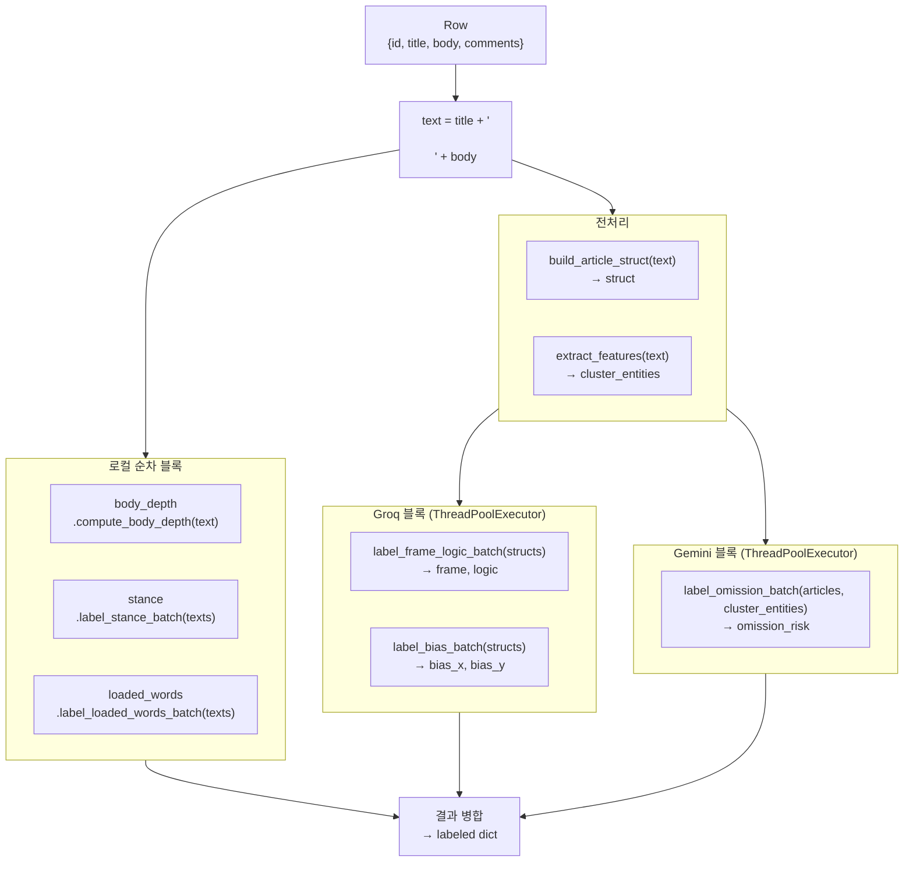

### 3-B. 로컬 블록 상세

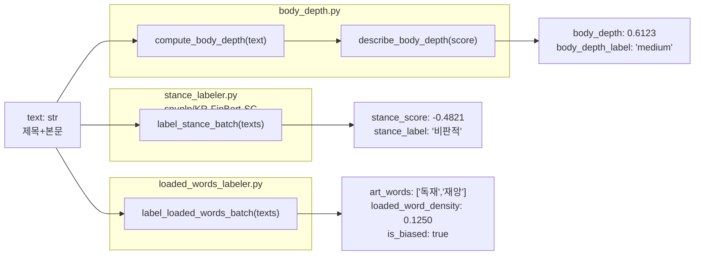

**body_depth IN/OUT:**

```python
# IN
text = "의대 정원 2000명 증원 확정\n\n정부는 2025학년도부터 의대 정원을 2000명 늘리기로 했다..."

# OUT
{
    "body_depth":       0.6123,
    "body_depth_label": "medium"
}
```

**stance IN/OUT:**

```python
# IN
texts = ["정부의 의대 증원 결정은 매우 잘못되었다.", "새 정책이 발표되었다."]

# OUT
[
    {"stance_score": -0.6821, "stance_label": "비판적"},
    {"stance_score":  0.0312, "stance_label": "중립"}
]
```

**loaded_words IN/OUT:**

```python
# IN
texts = ["정부의 독재적 선동이 재앙을 부르고 있다.", "오늘 국회에서 예산안을 논의했다."]

# OUT
[
    {
        "loaded_words":        ["독재", "선동", "재앙"],
        "loaded_word_density": 0.1667,
        "is_biased":           True,
        "tier":                1
    },
    {
        "loaded_words":        ["오늘", "국회"],   # Tier-3 폴백
        "loaded_word_density": 0.0,
        "is_biased":           False,
        "tier":                3
    }
]
```

---

### 3-C. Groq 블록 상세

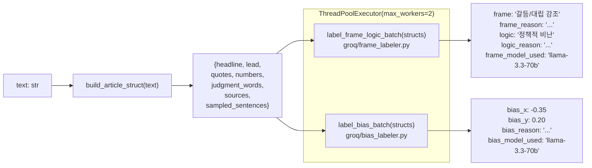

**build_article_struct IN/OUT:**

```python
# IN
text = "의대 증원 강행…교육부, 대학에 최후통첩\n\n정부가 2025학년도 의대 정원을..."

# OUT
{
    "headline":          "의대 증원 강행…교육부, 대학에 최후통첩",
    "lead":              "정부가 2025학년도 의대 정원을 2000명 늘리기로 확정하면서...",
    "quotes":            ["전례 없는 일이다", "협의 없이 일방 통보했다"],
    "numbers":           ["2000명", "30%", "40억원"],
    "judgment_words":    ["강행비판", "우려촉구", "반발"],
    "sources":           ["교육부", "의협", "대학 관계자"],
    "sampled_sentences": ["정부가 결정했다.", "학교 측은 반대했다.", "사태는 장기화될 전망이다."],
    "total_sentences":   24
}
```

**label_frame_logic_batch IN/OUT:**

```python
# IN
structs = [
    {
        "headline":       "의대 증원 강행…교육부, 대학에 최후통첩",
        "lead":           "정부가 2025학년도 의대 정원을 2000명 늘리기로...",
        "quotes":         ["전례 없는 일이다", "협의 없이 일방 통보했다"],
        "numbers":        ["2000명", "30%"],
        "judgment_words": ["강행비판", "우려촉구"],
        ...
    }
]

# OUT
[
    {
        "frame":        "갈등/대립 강조",
        "frame_reason": "정부-의협 간 갈등 구도를 전면에 배치",
        "logic":        "정책적 비난",
        "logic_reason": "정부 정책의 부당성을 중심으로 논거 구성",
        "frame_model_used": "meta-llama/llama-3.3-70b-versatile"
    }
]
```

**label_bias_batch IN/OUT:**

```python
# IN
structs = [{"headline": "...", "lead": "...", ...}]

# OUT
[
    {
        "bias_x":      -0.35,
        "bias_y":       0.20,
        "bias_reason": "정부 정책에 비판적, 피해자 감성 중심이나 일부 수치 인용",
        "bias_model_used": "meta-llama/llama-3.3-70b-versatile"
    }
]
```

---

### 3-D. Gemini 블록 상세

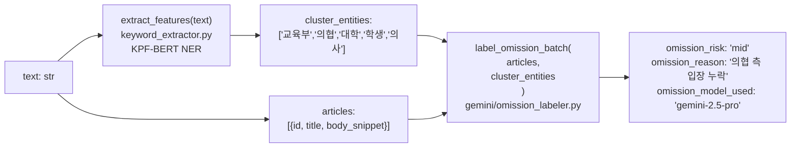

**extract_features IN/OUT:**

```python
# IN
text = "교육부가 의협의 반발에도 불구하고 2000명 증원을 강행했다..."

# OUT
{
    "sentences":       ["교육부가 의협의 반발에도...", "대학들은 일방 통보에 항의했다.", ...],
    "entities":        [
        {"word": "교육부", "entity_group": "ORG", "score": 0.99},
        {"word": "의협",   "entity_group": "ORG", "score": 0.98},
        {"word": "2000명", "entity_group": "QTY", "score": 0.95}
    ],
    "entity_count":    8,
    "entity_density":  0.33,
    "num_density":     0.12,
    "quote_count":     3,
    "source_count":    4,
    "paragraph_count": 6,
    "sentence_count":  24
}
# cluster_entities 추출 → ["교육부", "의협", "대학", "학생", "의사"]
```

**label_omission_batch IN/OUT:**

```python
# IN
articles = [
    {
        "id":           "123",
        "title":        "의대 증원 강행",
        "body_snippet": "정부가 2000명 증원을 강행하기로 했다..."
    }
]
cluster_entities = ["교육부", "의협", "대학", "학생", "의사"]

# OUT
[
    {
        "omission_risk":   "mid",
        "omission_reason": "의협의 반발 입장이 언급되지 않았고, 학생 피해 관련 수치 누락",
        "omission_model_used": "gemini-2.5-pro"
    }
]
```

---

### 3-E. 배치 실패 폴백

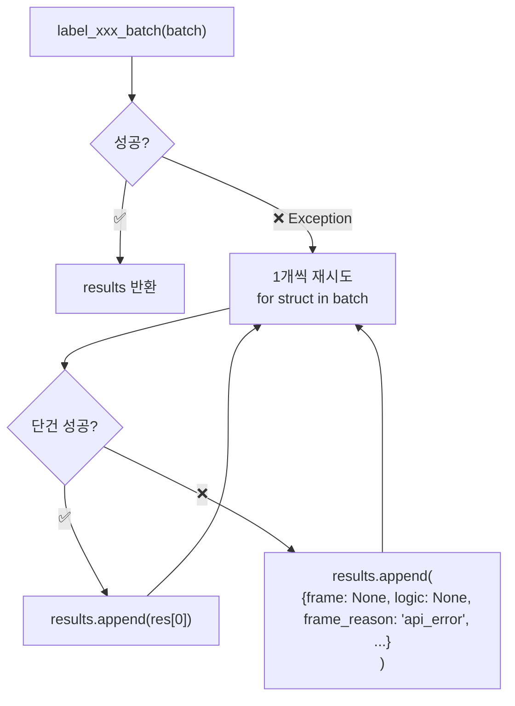

---

## 4. 댓글 라벨링 파이프라인

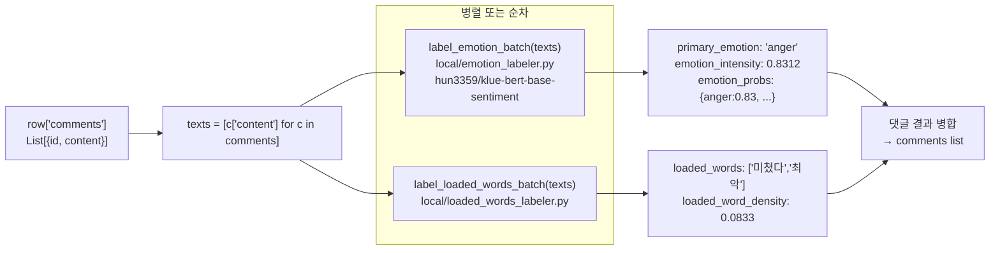

**label_emotion_batch IN/OUT:**

```python
# IN
texts = ["이게 말이 되냐고 진짜 화난다", "좋은 결과가 나왔으면 좋겠다"]

# OUT
[
    {
        "primary_emotion":   "anger",
        "raw_label":         "분노",
        "emotion_intensity": 0.8312,
        "emotion_probs": {
            "anger":   0.8312,
            "disgust": 0.0921,
            "fear":    0.0412,
            "joy":     0.0180,
            "neutral": 0.0175
        }
    },
    {
        "primary_emotion":   "joy",
        "raw_label":         "기쁨",
        "emotion_intensity": 0.6240,
        "emotion_probs": {"joy": 0.6240, "neutral": 0.2100, ...}
    }
]
```

---

## 5. 출력 파일 생성

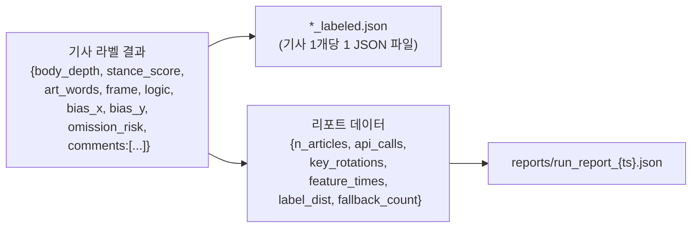

**`*_labeled.json` 전체 예시:**

```json
{
  "article_id":    "123",
  "title":         "의대 증원 강행",
  "body_depth":    0.6123,
  "body_depth_label": "medium",
  "stance_score":  -0.4821,
  "stance_label":  "비판적",
  "art_words":     ["독재", "재앙", "선동"],
  "loaded_word_density": 0.1250,
  "is_biased":     true,
  "frame":         "갈등/대립 강조",
  "frame_reason":  "정부-의협 간 대립 구도 전면 배치",
  "logic":         "정책적 비난",
  "logic_reason":  "정부 정책의 부당성을 논거로 구성",
  "frame_model_used": "meta-llama/llama-3.3-70b-versatile",
  "bias_x":        -0.35,
  "bias_y":        0.20,
  "bias_rationale":"진보 성향 신호 강함, 일부 사실적 수치 인용",
  "bias_model_used": "meta-llama/llama-3.3-70b-versatile",
  "omission_risk": "mid",
  "omission_reason": "의협 측 입장 누락",
  "omission_model_used": "gemini-2.5-pro",
  "comments": [
    {
      "id":                "c1",
      "primary_emotion":   "anger",
      "emotion_intensity": 0.8312,
      "cmt_words":         ["미쳤다", "최악"],
      "cmt_word_density":  0.0833
    }
  ]
}
```

**`run_report_{ts}.json` 전체 예시:**

```json
{
  "keyword":        "의대정원",
  "run_id":         "의대정원_20260322_143022",
  "n_articles":     50,
  "total_comments": 312,
  "api_calls":      {"groq": 20, "gemini_pro": 50},
  "key_rotations":  [{"from_key": 0, "to_key": 1, "reason": "rate_limit"}],
  "feature_times":  {
    "body_depth": 0.8,
    "stance":     45.2,
    "frame_logic": 120.3,
    "bias":        118.7,
    "omission":    95.1,
    "emotion":     38.4,
    "loaded_words": 2.1
  },
  "label_dist": {
    "frame": {"갈등/대립 강조": 18, "사건 원인 집중": 14, "경제적 영향 강조": 8, ...},
    "logic": {"정책적 비난": 20, "전문가 견해": 12, "사실/정보 전달": 10, ...}
  },
  "fallback_count": {"frame": 2, "bias": 0, "omission": 1}
}
```

---

## 6. DB 업로드 파이프라인

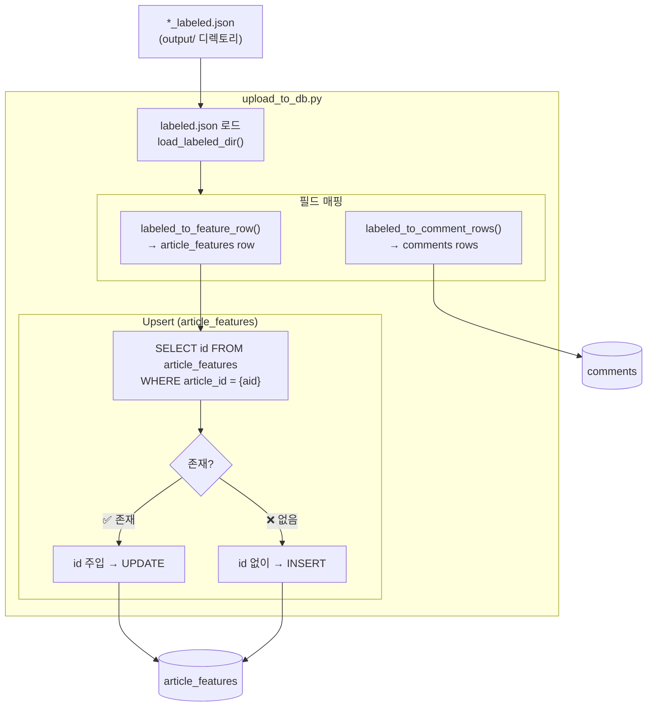

**필드 매핑 IN/OUT:**

```python
# IN (labeled.json)
{
    "article_id":    "456",
    "frame":         "갈등/대립 강조",    # → FRAME_MAP[str] → 2
    "logic":         "정책적 비난",       # → LOGIC_MAP[str] → 1
    "bias_x":        -0.35,
    "bias_y":        0.20,
    "omission_risk": "mid",              # → 0
    "body_depth":    0.6123,
    "stance_score":  -0.4821,
    "art_words":     ["독재", "재앙"],
    "comments": [
        {
            "id":            "c1",
            "emotion_probs": {"anger": 0.8312, "disgust": 0.0921, ...},
            "cmt_words":     ["미쳤다", "최악"]
        }
    ]
}

# OUT → article_features row
{
    "article_id":    456,          # str → int
    "frame_id":      2,            # "갈등/대립 강조" → 2
    "logic_id":      1,            # "정책적 비난" → 1
    "bias_x":        -0.35,
    "bias_y":        0.20,
    "omission_risk": 0,            # "mid" → 0
    "body_depth":    0.6123,
    "stance_score":  -0.4821,
    "art_words":     ["독재", "재앙"],   # jsonb
    "created_at":    "2026-03-22T14:30:22"
}

# OUT → comments rows (id=c1)
{
    "cmt_emotion": {               # top 10, jsonb
        "anger":   0.8312,
        "disgust": 0.0921,
        "fear":    0.0412,
        "joy":     0.0180,
        "neutral": 0.0175
    },
    "cmt_words": ["미쳤다", "최악"]    # jsonb
}
```

---

## 7. 실험 프레임워크 흐름

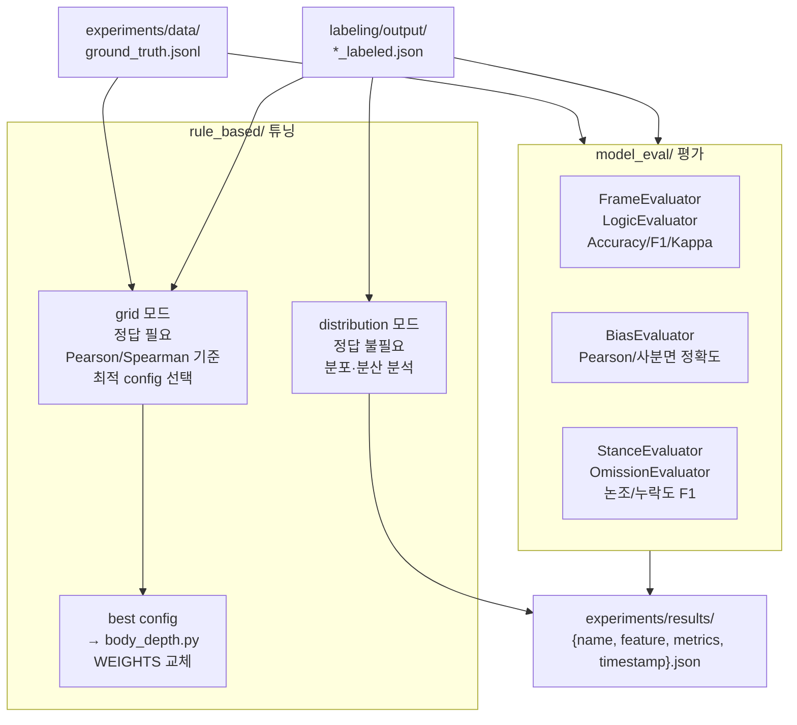

**Ground Truth JSONL 형식:**

```jsonl
{"id": "123", "text": "의대 증원 강행\n\n정부는 2025학년도부터...", "labels": {"body_depth": 0.75, "frame": 2, "logic": 1, "bias_x": -0.35, "bias_y": 0.20, "omission_risk": 0, "stance_score": -0.45, "loaded_words": ["독재", "재앙"]}}
{"id": "124", "text": "의협 총파업 예고\n\n의사협회는 오늘 총파업을...", "labels": {"body_depth": 0.52, "frame": 1, "logic": 3, "bias_x": -0.10, "bias_y": -0.30, "omission_risk": 1, "stance_score": -0.20, "loaded_words": ["파업", "압박"]}}
```

**ExperimentResult 저장 형식:**

```json
{
  "name":      "diversity_quote_heavy",
  "feature":   "body_depth",
  "config":    {
    "w_diversity": 0.35, "w_quotes": 0.30,
    "w_length": 0.15, "w_numerics": 0.10, "w_structure": 0.10,
    "length_soft_max": 2000
  },
  "metrics":   {"pearson": 0.812, "spearman": 0.803, "mae": 0.091},
  "n_samples": 50,
  "timestamp": "20260322_143022"
}
```

---

## 8. 모듈 의존 관계

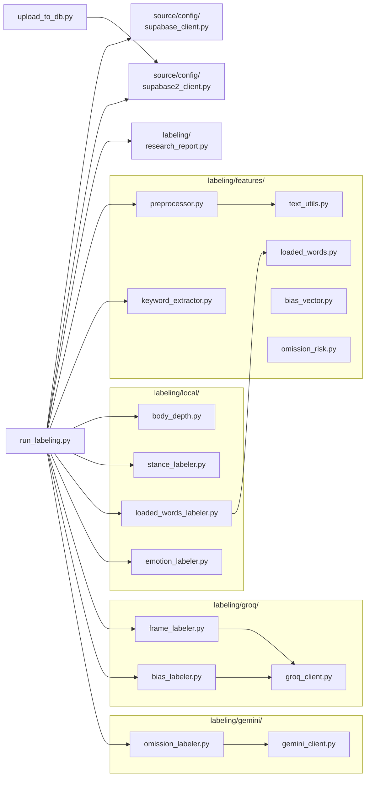
